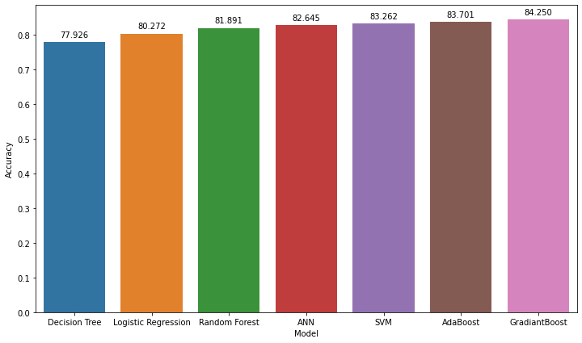
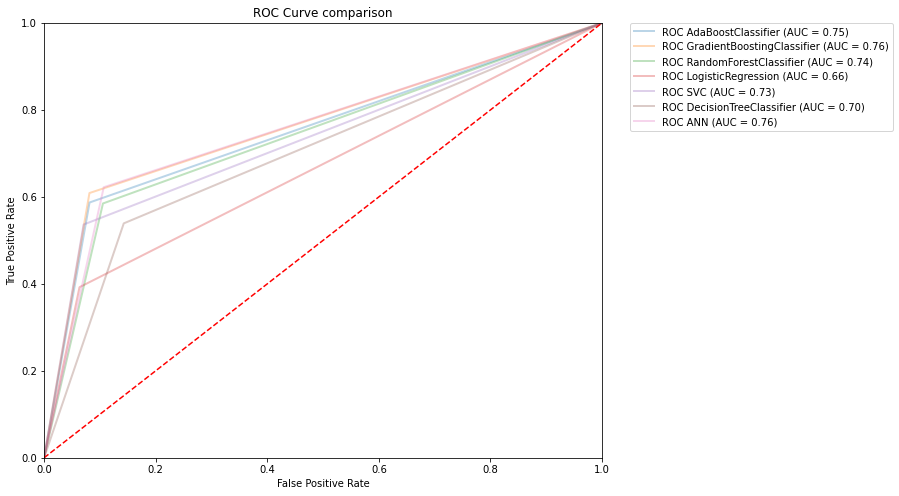

# Income-Prediction-and-Analysis

## Course : CSE 445 

**Objective :**

•	To predict the income of a person\
•	To determine the factors for a higher income\
•	To test and evaluate performance of different Machine Learning algorithms\
•	To visualize and analyze data

**Dataset :**

https://www.kaggle.com/uciml/adult-census-income

**Algorithms**

•	Logistic Regression\
•	SVM\
•	Decision Trees\
•	Random Forest\
•	ANN\
•	Ada Boosting\
•	Gradient Boosting

**Comparison(Accuracy)**

**ROC Curve Comparison**

